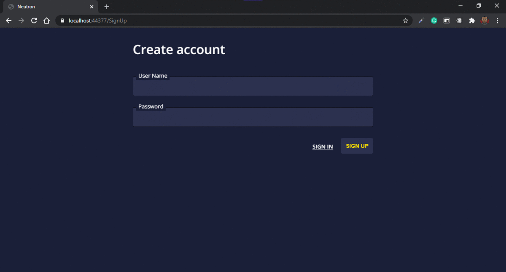

<h1 align="center">
  Neutron
</h1>

<p align="center">
  <a href="#rocket-project">Project</a>&nbsp;&nbsp;&nbsp;|&nbsp;&nbsp;&nbsp;
  <a href="#computer-techs">Techs</a>&nbsp;&nbsp;&nbsp;|&nbsp;&nbsp;&nbsp;
  <a href="#thinking-how-to-use">How to use</a>&nbsp;&nbsp;&nbsp;|&nbsp;&nbsp;&nbsp;
  <a href="#memo-license">License</a>
</p>

## :rocket: Project

:calendar: Neutron is a simple countdown manager.

### Preview

<p align="center">
  
</p>

## Features

- [x] User can create an account
- [x] User can sign-in
- [x] User can sign-out
- [x] User can create a event
- [x] An event must have a name
- [x] An event must have a target date
- [x] User can have just four events
- [x] User can visualize your events decreasing its time in real-time
- [x] Layout

## :computer: Techs

- .NET Core
- ASP.NET Core MVC
- ASP.NET Identity Core
- AutoMapper
- C#
- CSS
- Entity Framework Core
- HTML
- JavaScript
- JQuery
- JQuery Validation
- JQuery Validation Unobtrusive
- SQLite
- MediatR
- Razor

## :thinking: How to use

### Requirements

- .NET Core 3.1
- .NET Entity Framework Core CLI
- Git

## :memo: License

```bash
# clone the repository

git clone https://github.com/flaviogf/neutron.git

# enter into the folder

cd neutron

# restore dependencies

dotnet restore

# run migrations of the identity database

dotnet ef database update --context IdentityDbContext --project src/Neutron.Web/Neutron.Web.csproj

# run migrations of the neutron database

dotnet ef database update --context NeutronDbContext --project src/Neutron.Web/Neutron.Web.csproj

# start the project

dotnet run --project src/Neutron.Web/Neutron.Web.csproj

# access the link -> https://localhost:5001/SignUp
```

This project is under the GNU license. See the file [LICENSE](LICENSE) for more details.
